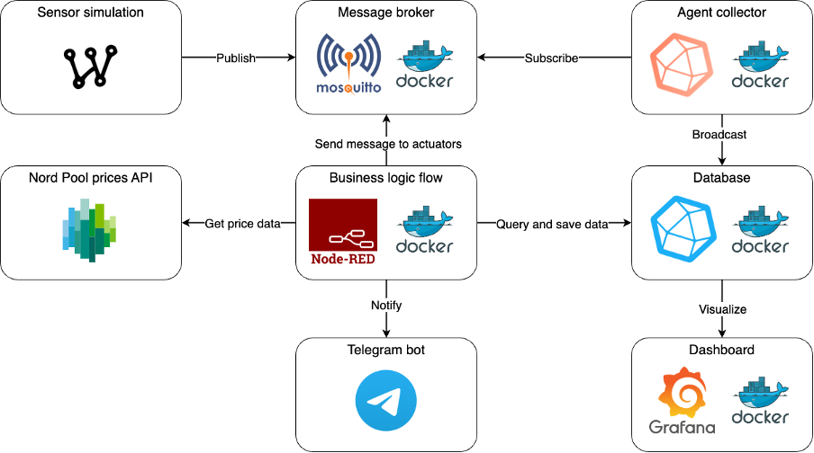
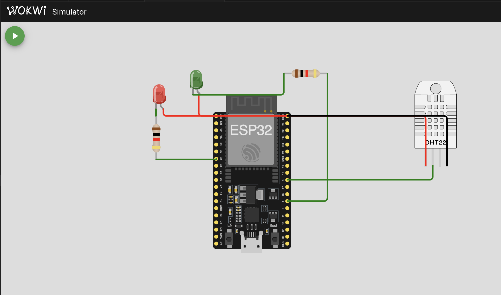

# PeakFlip
Reducing electricity costs using an IoT system

## Background:
As the electricity market in Europe becomes more and more liberal, spot pricing is now a norm. This change is largely due to the widespread renewable energy usage and supply-demand imbalance. With spot pricing, electricity prices fluctuate throughout the day, making energy costs unpredictable. For example, in the morning when the sun shines, solar energy boosts the electricity supply, dropping the electricity price. In contrast, in the evening, supply decreases and demand goes up, prices can skyrocket. This leads to the need for a solution to utilize electricity bills, like purchasing electricity during an off-peak while still maintaining the necessary electricity usage.

We propose an IoT-based smart house system solution, PeakFlip, by taking advantage of fluctuating spot prices. This system automates electricity usage during low-price periods, helping consumers lower their energy costs. Additionally, PeakFlip sends alerts if predicted electricity consumption exceeds a pre-set threshold or if peak electricity price hours are coming. To demonstrate its functionality, we simulated a smart water boiler that regularly measures water level, as well as inside and outside temperature. The simulated device aims to reduce electricity consumption while maintaining a comfortable water temperature. 

## Built With

| Technology       |                                                                                         | Description                                  |
|-------------------|---------------------------------------------------------------------------------------------|----------------------------------------------|
| Wokwi            |                         | Online hardware simulation platform          |
| Apache Mosquitto |  | MQTT broker for lightweight messaging        |
| InfluxDB         |            | Time-series database for IoT data            |
| Docker           |                   | Tool for containerization and orchestration  |
| Node-RED         |           | Flow-based development tool for IoT          |
| Grafana          |  | Analytics and monitoring visualization tool  |

### Data Flow

## Wokwi Implementation

This system is implemented using an ESP32 device, which handles data reception from sensors and manages actuators. To visualize the implementation, we use the Wokwi service, which simulates the physical world. The Wokwi implementation operates outside of the Docker container and includes randomized data readings, with an optional physical sensor example.

### System Features:
- **Data Sensors**: The system reads data from a DHT22 sensor and simulates other data such as temperature, water level, and electricity consumption.
- **Actuators**: It controls devices like LEDs and water pumps based on MQTT commands. Two LEDs represent the actuators—an LED lights up when the actuator (e.g., heating) is active, and turns off when it's not.

### MQTT Communication:
- **Publishing**: Sensor data (temperature, water level, electricity consumption) are published every 1 second.
- **Topics**: Data is published under topics like `/home_1/device_1/water_temperature`, `/home_1/device_1/outside_temperature`, `/home_1/device_1/water_level`, `/home_1/device_1/electricity_consumption`.
- **Subscribing**: The system subscribes to dynamic topics, such as `/home_1/device_1/#`.

### Hardware Setup:
- **LED Red (D32)**: Connected to pin 32.
- **LED Green (D4)**: Connected to pin 4.
- **DHT22 Sensor**: Connected to pin 5.
- **WiFi**: Connected via Wokwi-GUEST for network access.

### Setup Instructions:
1. Install the Wokwi Simulator in Visual Studio Code.
2. Log in to activate your license.
3. Make sure to run the Docker container.
4. Build the project by typing `pio run` in the terminal.
5. To start the simulation, open VS Code and select `Wokwi: Start Simulation`.
6. Click the start button to begin the visualization.
7. Observe the serial monitor for connection logs, received MQTT messages, and published data.

### Customization:
The system can handle multiple devices by renaming the **Home ID** (`home_1`) and **Device ID** (`device_1`).

